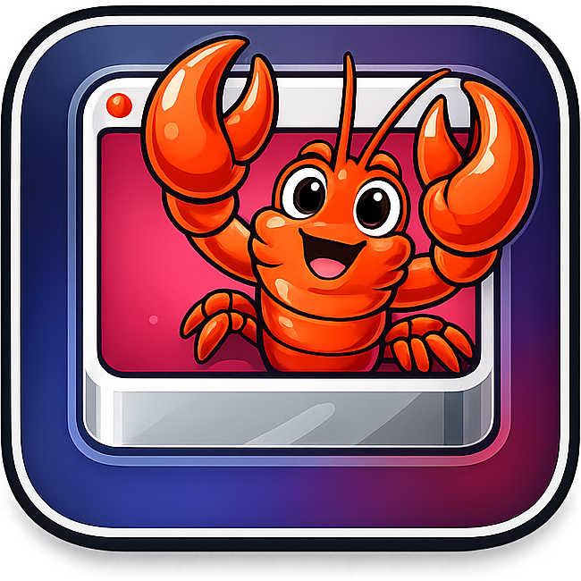

<div align="center">
  
  <h1>Clawbox</h1>
  <h3>OpenClaw-ready macOS VMs</h3>
  <p>Simple for standard users, powerful for OpenClaw developers.</p>
</div>

<p align="center">
  <a href="https://github.com/joshavant/clawbox/actions/workflows/ci.yml"></a>
  <a href="https://github.com/joshavant/clawbox/blob/main/LICENSE"></a>
  <a href="https://github.com/joshavant/clawbox"></a>
</p>

---
## Quick Start

```bash
brew install joshavant/tap/clawbox
clawbox image build && clawbox up
```

> ⚠️: `clawbox image build` is a one-time step that downloads a large macOS base image: this can take several minutes!

Login with password `clawbox` then onboard your OpenClaw with:

```bash
openclaw onboard --install-daemon
```

**That’s it! Enjoy your new crustacean. 🦞**

---

## What is Clawbox?

Clawbox is a tool for deploying OpenClaw-ready macOS VMs.

Each OpenClaw instance runs in its own VM, while OpenClaw itself stays unchanged.

And, while you’re at it, you can easily provision your VM with things like Tailscale, Playwright, and more!

## Who Clawbox Is For

- **Standard users:** want one simple command to set up OpenClaw in its own VM.
- **Developer users:** want to run multiple, concurrent VMs using host-mounted source/payload folders.

## Standard Mode (Default)

`standard` mode installs the latest official OpenClaw release in the VM.

Prerequisite (one-time requirement):

```bash
clawbox image build
```
> **Note:**  This is a large download and can take several minutes!

Deploy OpenClaw in a macOS VM:

```bash
clawbox up
```

You can also install optional services, like Tailscale, Playwright, and more:

```bash
clawbox up \
  --add-playwright-provisioning \
  --add-tailscale-provisioning \
  --add-signal-cli-provisioning
```

See the full list in [Optional Dependency Provisioning](#optional-dependency-provisioning-both-modes).

## Developer Mode (Advanced)

`developer` is intended for managing custom payload workflows or developing OpenClaw:

- Mounts your local OpenClaw source and payload into the VM.
- Pass those paths with `--openclaw-source` and `--openclaw-payload`.
- Each VM can use different checkout/payload copies for concurrent work.
- Mounted checkouts are linked as the VM's `openclaw` command.

### Single VM example:

```bash
clawbox up --developer \
  --openclaw-source ~/Developer/openclaw-1 \
  --openclaw-payload ~/Developer/openclaw-payloads/clawbox-1
```

### Two VM example:

```bash
clawbox up --developer --number 1 \
  --openclaw-source ~/Developer/openclaw-1 \
  --openclaw-payload ~/Developer/openclaw-payloads/clawbox-1

clawbox up --developer --number 2 \
  --openclaw-source ~/Developer/openclaw-2 \
  --openclaw-payload ~/Developer/openclaw-payloads/clawbox-2
```

> **Note:** Apple's macOS Software License Agreement permits up to two virtualized macOS instances per Apple host. Clawbox can target other VM numbers, but host virtualization limits may block additional concurrent VMs.

For source-driven dev loops, combine with OpenClaw's documented file watcher flow:

```bash
cd ~/Developer/openclaw
pnpm gateway:watch --force
```

## Optional Dependency Provisioning

Customize your VM with additional services by using these flags with `up`:

- Tailscale: `--add-tailscale-provisioning`
- Playwright + browsers: `--add-playwright-provisioning`
- `signal-cli`: `--add-signal-cli-provisioning`

Tailscale requires a manual, interactive approval step for permission prompts after VM creation.

### signal-cli Payload Mounting (Developer-Only)

To configure `signal-cli` with an existing configuration payload:

```bash
clawbox up --developer \
  --openclaw-source ~/Developer/openclaw-1 \
  --openclaw-payload ~/Developer/openclaw-payloads/clawbox-1 \
  --add-signal-cli-provisioning \
  --signal-cli-payload ~/.local/share/signal-cli
```

Rules:

- Clawbox seeds VM-local `~/.local/share/signal-cli`, then syncs VM changes back to host payload.
- Single-writer locking is enforced for signal payload paths.

Details: [`docs/signal-cli-payload-sync.md`](./docs/signal-cli-payload-sync.md)

## VM Recreation

Recreate a VM using the original configuration options:

```bash
clawbox recreate 1
```

This performs `down + delete + up` with the same profile/flags you originally passed to `up`.

## What Clawbox Installs

- Homebrew
- Node.js
- OpenClaw
- Terminal.app desktop shortcut
- SSH access for `clawbox-<number>` (default password: `clawbox`)
- macOS defaults (Setup Assistant suppression, dark mode, Siri off, wallpaper, etc.)
- Tart Guest Agent (clipboard sharing support)
- Optional dependency provisioning
- …and a lobster-toned wallpaper

## Command Surface

- Main lifecycle: `up`, `recreate`, `down`, `delete`, `status`, `ip`
- Component workflow: `create`, `launch`, `provision`
- Image management: `image init`, `image build`, `image rebuild`

`clawbox status` shows the full Clawbox environment (all detected `clawbox-*` VMs).
Use `clawbox status <number>` for single-VM detail.

Run `clawbox --help` for full command/flag docs.

## Maintainer and CI Docs

- Developer and debugging guide: [`DEVELOPER.md`](./DEVELOPER.md)
- Contributing workflow: [`CONTRIBUTING.md`](./CONTRIBUTING.md)
